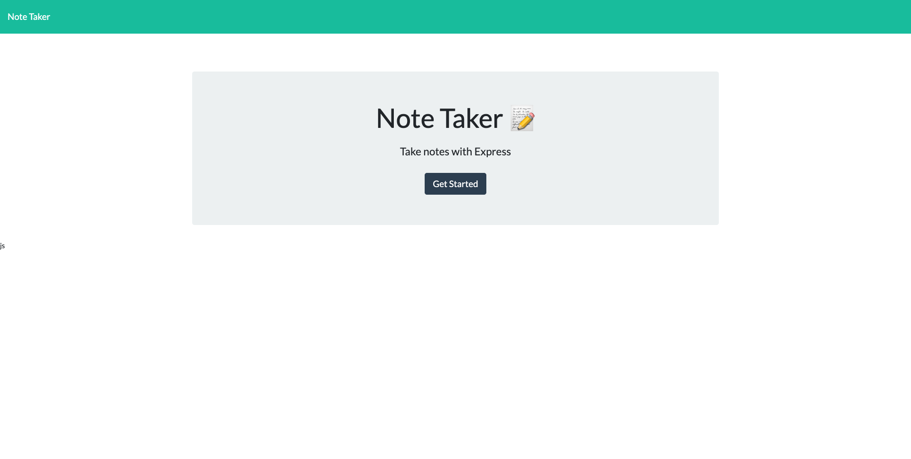
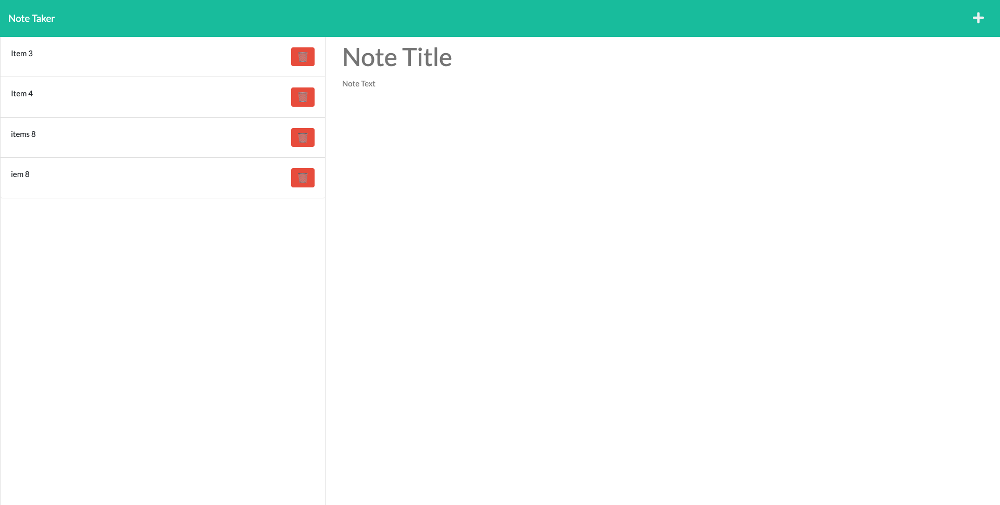

# note-taker

Application called Note Taker that can be used to write and save notes

# Installation

```
git clone
cd phase 2 cd note-taker
npm i
```

# Usage

```
npm run start on src folder
npm run dev


```

## Screenshots





# Heroku Deployed Link

[heroku link](https://awarsame-note-taker-app.herokuapp.com/)

## Technology Used

GitHub
Terminal
VSCode
Express
DataBase
NPM
Node JS

## Contact Me

[Email Me ](abdilatifwarsame@gmail.com)

[GitHub ](https://github.com/awarsame1996)
